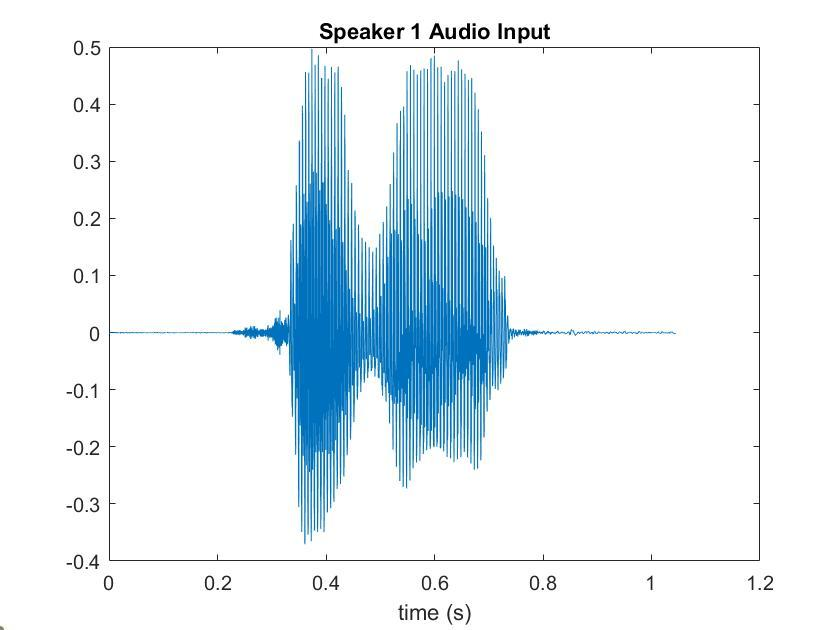
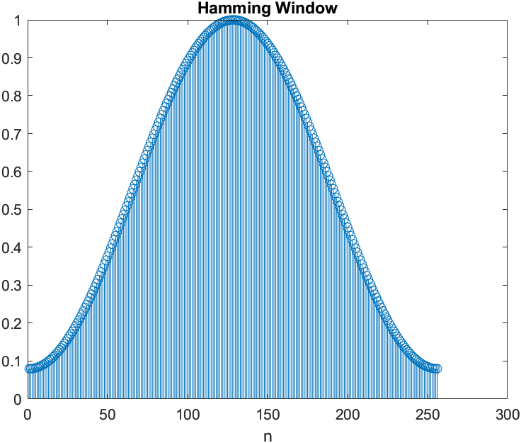
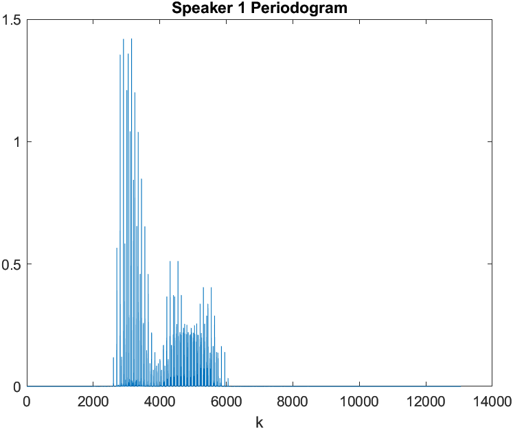
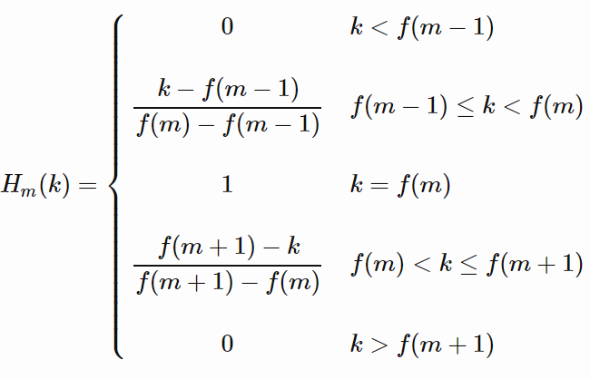
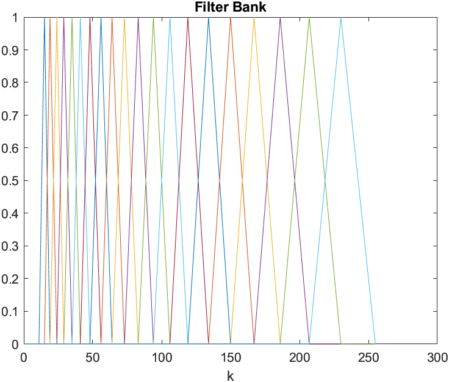
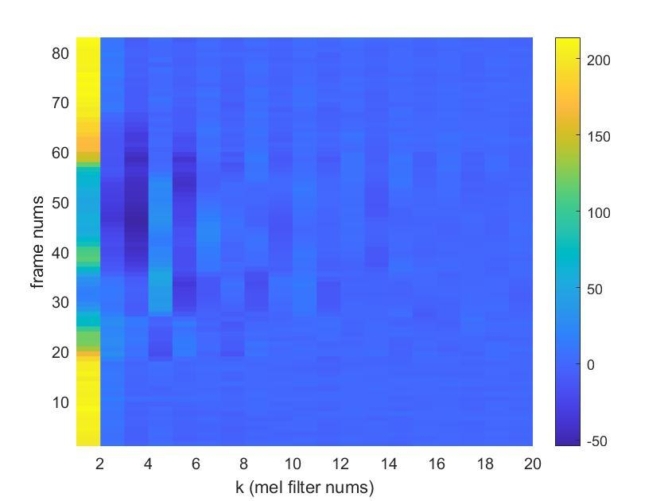
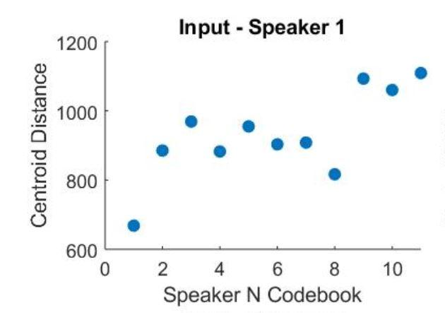

**EEC 201**

**Winter 2020**

**Final Project**

**Speaker Recognition**

**James Nelson and Laura Shimabukuro**


# Objective

The goal of this project is to extract features from human voices to build a system to classify a set of speakers.  Mel-Frequency Cepstrum Coefficients (MFCC) were used as features and Vector Quantization (VQ) was used as the training/classification system.

# Part 1: Speech Processing and Feature Extraction

**Amplitude Normalization and Framing**

In order for the system to perform speech recognition, the key features of each speaker must first be extracted from the input audio signals. The inputs into the system are .wav files sampled at 12500 Hz. An example time domain signal plot for speaker 1 from the training set is shown below in Figure 1.

After sampling, the signal undergoes amplitude normalization from -1 to 1 to account for sound volume variations. The normalized signal is then split into approximately 30 ms frames (frame length N = 256) with a slight overlap (overlap M = 100) between adjacent frames. The frame overlaps prevent data loss during processing.



**Figure 1: Speaker 1 Time Domain Plot**

```
   for k = 1:numFrames

        frames(k,:) = s(startindex:endindex);

        frames(k,:) = frames(k,:);

        startindex = startindex+N-M;

        endindex = startindex+N-1;
```

**Windowing**

Once the signal is split into frames, a hamming window, shown below in Figure 2, is applied to each frame to taper the end samples to equal near-zero amplitudes. If the end samples are not tapered to the same amplitude, they will show up as unwanted high frequency components when processed frame by frame through the STFT, because the periodicity of the DFT causes it to treat the disconnected beginning and end points as a discontinuity.



**Figure 2: Hamming Window**

```
y(k,:) = frames(****k****,:).*w';
```
**Periodogram Generation**

To estimate the spectral density of each signal, a periodogram estimate of the power spectral density is computed for each signal. First, the Short Time Fourier Transform is applied to each frame by taking an N length FFT of each frame and multiplying the output by a linear phase term to remove time normalization. The frame by frame output of the STFT is squared and averaged over the length of each frame.  Since it is realistically impossible to average the squared spectrum over an infinite interval, squaring over the frame length provides a suitable estimate for the PSD. After generating the frame by frame periodogram estimate, the full signal periodogram is computed by summing all of the individual frame periodograms together. The overlaps are taken into account by zero padding both sides of each frame vector to the correct length and position with respect to the original signal before the full summation. The output periodogram for speaker 1 is shown below in Figure 3.



**Figure 3: Speaker 1 Periodogram**

```
frames_fft(k,:) = fft(y(k,:));

% compute periodogram

P(k,:) = ((abs(exp(-1i.*M.*n.*(k-1)).*frames_fft(k,:))).^2)/N;

zp = zeros(1,(k-1).*M);**

Pgram(k,:) = [zp P(k,:) zeros(1,abs(length(s)-length(zp)-length(P(k,:))))];
```

**Filter Bank Generation**

This system is designed to model human hearing, and since humans are better at sensing pitch differences at lower frequencies, mel frequency scaling is used to emphasize lower frequency components during feature extraction. First, a filter bank is generated with unity gain triangular filters spaced out on the mel scale. The filter bank start frequency was chosen at 300 Hz and the end frequency was chosen at half the sampling frequency of the input signal. After the start and end frequencies are converted to the mel scale and linearly spaced mel frequency points are computed, the points are reconverted to Hz and rounded to the nearest FFT bin. The formula used to generate the filter bank is shown below in Figure 4. The output filter bank is shown in Figure 5.



![image alt text]**Figure 4: Filter Bank Formula**  **Figure 5: Filter Bank Plots**

                      


# Part 2: Classification Through Vector Quantization

**Classification Method**

Classification of an input signal to the training set is done through a technique known as vector quantization.  After feature extraction, a signal will have a Mel Cepstrum Coefficient matrix (S) with dimensions the number of mel filters (mN) by number of frames (f).  Mathematically, each signal generates an S fxmN matrix.  During the training phase, the matrix S is shrunk to a codebook matrix C of size c x mN where c is the number of codebooks, or centroids, chosen and mN is still the number mel filters.

**Signal Length Normalization**

Since the sum error of a long signal will be more than a short signal, some type of normalization must be done on the length of the signal to account for this.  We looked at two methods of normalizing for length.  Method 1 simply divides the

.jpg)

**Figure 6. Normalization of Length Method 1**


**Figure 7. Normalization of Length Method 2 **

# Part 3: Classification Results

For classification results, we compare the human classification results (Tab. 1), to the baseline speaker classification system (Fig. 8), to our optimized system (Fig. 9).  For the purposes of this project, we assume human classification of speakers as the optimal solution..

<table>
  <tr>
    <td>SNR</td>
    <td>Result</td>
  </tr>
  <tr>
    <td>40dB</td>
    <td>Correct</td>
  </tr>
  <tr>
    <td>35dB</td>
    <td>Correct</td>
  </tr>
  <tr>
    <td>30dB</td>
    <td>Correct</td>
  </tr>
  <tr>
    <td>25dB</td>
    <td>Correct</td>
  </tr>
  <tr>
    <td>20dB</td>
    <td>Correct</td>
  </tr>
  <tr>
    <td>15dB</td>
    <td>Correct</td>
  </tr>
  <tr>
    <td>10dB</td>
    <td>Incorrect</td>
  </tr>
  <tr>
    <td>5dB</td>
    <td>Incorrect</td>
  </tr>
</table>


**Table 1. Human Classification Results**



**Figure 8. Unoptimized System Block Diagram**


**Figure 9. Optimized System Block Diagram**

To show the classification of an arbitrary input, we generate the following plot (Fig 10).



**Figure 10. Example Classification Output**

The x-axis represents the speaker’s numbers.  The y-axis shows the sum of all distances from the closest centroid i.e. how close the input signal is to the training set.  A lower distance therefore means higher similarity.  For example, in figure 10, the input of Speaker 1 is shown to have the smallest distance to the training set codebook of Speaker 1.

To test the boundary of our classification system, we add various levels of white, Gaussian noise to the input signal until an incorrect classification is made.  The results of the unoptimized system are shown in figure 11.  A correct classification is made with an SNR of 25dB and the system fails with SNR of 20dB.  Results of the optimized system are shown in figure 12.  By adding sinusoidal liftering after the DCT is calculated, the system is accurate to between 15-20dB, closer to the optimal solution of human recognition.


**Figure 11. Unoptimized System Results with Various Levels of Noise**


**Figure 12. Optimized System Results with Various Levels of Noise**

# Part 4: MATLAB Graphical User Interface (GUI)

To interface with our training and classification system, a GUI was created using MATLAB AppDesigner.  The GUI allows the user to record a training input and a test input to add to the default 11 speakers.  As the final test on our system, we input 2 different male voices as a training and test input, to verify that different recording conditions from the provided training set did not lead to false classifications.  As shown in figure 13, the test input does not classify to the training input, as expected.  This verifies that the features extracted correspond to the speaker and the recording conditions have a negligible effect on the classification.


**Figure 13. MATLAB Graphical User Interface (GUI)**

# References

[1]  Vector Quantization - K-means.  MATLAB file exchange. [https://www.mathworks.com/matlabcentral/fileexchange/10943-vector-quantization-k-means](https://www.mathworks.com/matlabcentral/fileexchange/10943-vector-quantization-k-means)
