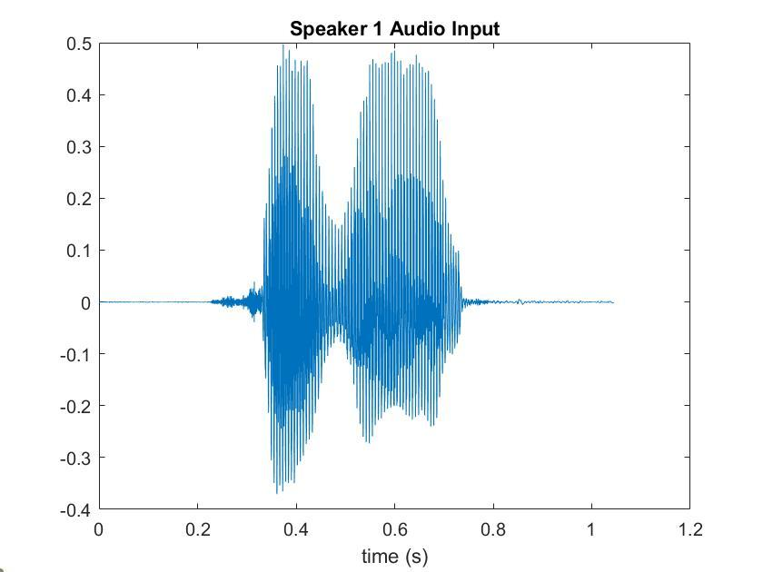
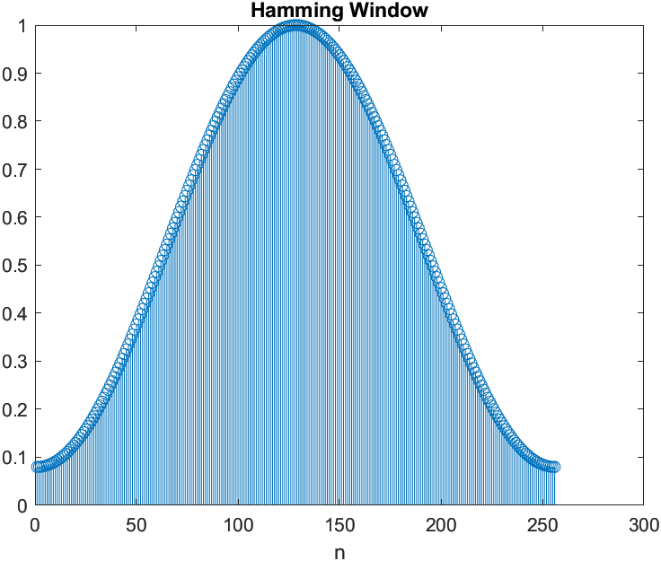
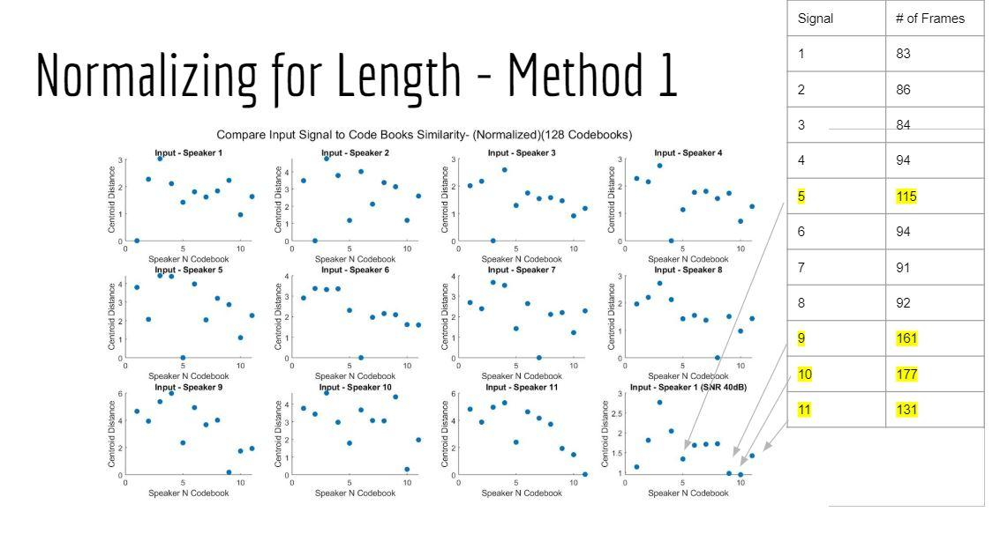
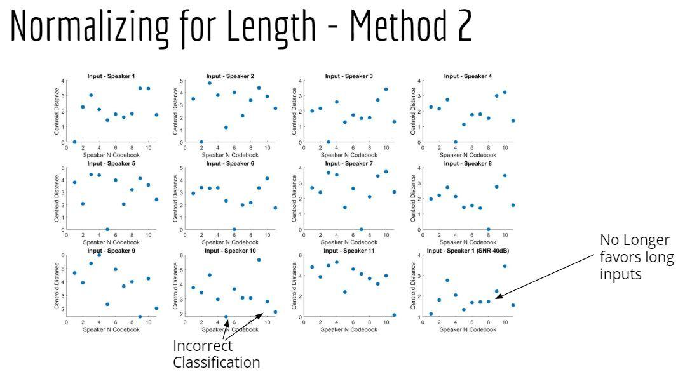
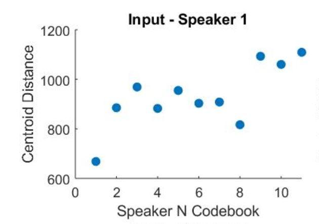
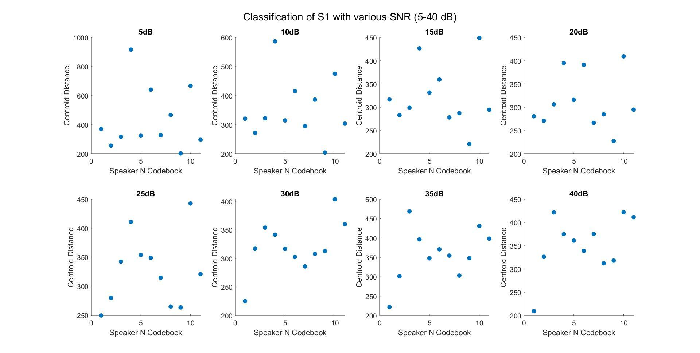
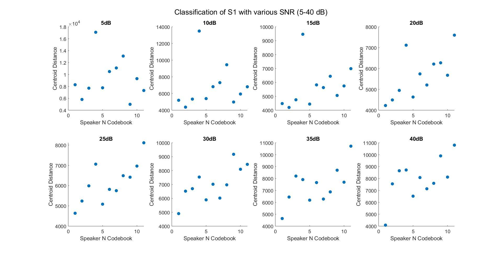
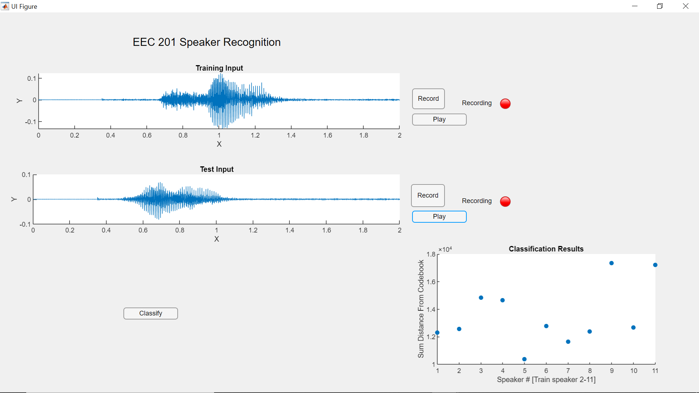

EEC 201

Winter 2020

Final Project

Speaker Recognition 

James Nelson and Laura Shimabukuro

# Objective

The goal of this project is to ….

# Part 1: Speech Processing and Feature Extraction

Amplitude Normalization and Framing

In order for the system to perform speech recognition, the key features of each speaker must first be extracted from the input audio signals. The inputs into the system are .wav files sampled at 12500 Hz. An example time domain signal plot for speaker 1 from the training set is shown below in Figure 1.

After sampling, the signal undergoes amplitude normalization from -1 to 1 to account for sound volume variations. The normalized signal is then split into approximately 30 ms frames with a slight overlap between adjacent frames. The frame overlaps prevent data loss during processing. 



**Figure 1: Speaker 1 Time Domain Plot**

```
    for k = 1:numFrames
        frames(k,:) = s(startindex:endindex);
        frames(k,:) = frames(k,:);
        startindex = startindex+N-M;
        endindex = startindex+N-1;
```

Windowing

Once the signal is split into frames, a hamming window, shown below in Figure 2, is applied to each frame to taper the end samples to equal near-zero amplitudes. If the end samples are not tapered to the same amplitude, they will show up as unwanted high frequency components when processed frame by frame through the STFT, because the periodicity of the DFT causes it to treat the disconnected beginning and end points as a discontinuity.



**Figure 2: Hamming Window**

Periodogram Generation

To estimate the spectral density of each signal, a periodogram estimate of the power spectral density is computed for each signal. The frame by frame output of the STFT is squared and averaged over the length of each frame.  Since it is impossible to average the squared spectrum over an infinite interval, squaring over the frame length provides a suitable estimate for the PSD. After generating the frame by frame periodogram estimate, the total signal periodogram is computed by summing all of the individual frame periodograms together, with correct time shifts and overlaps taken into account. The output periodogram for speaker 1 is shown below in Figure 3.

# Part 2: Classification Through Vector Quantization

Classification Method

Classification of an input signal to the training set is done through a technique known as vector quantization.  After feature extraction, a signal will have a Mel Cepstrum Coefficient matrix (S) that is of dimensions number of mel filters (mN) by number of frames (f).  Mathematically, each signal generates an S fxmN matrix.  During the training phase, the matrix S is shrunk to a codebook matrix C of size c x mN where c is the number of codebooks, or centroids, chosen and mN is still the number mel filters.

Signal Length Normalization



Fig N. Norma

# 

Fig N. 

# Part 3: Classification Results

For classification results, we compare the human classification results, to the baseline speaker classification system (Fig N), to our optimized system (Fig N).  For the purposes of this project, we assume human classification of speakers as the optimal solution..

<table>
  <tr>
    <td>SNR</td>
    <td>Result</td>
  </tr>
  <tr>
    <td>40dB</td>
    <td>Correct</td>
  </tr>
  <tr>
    <td>35dB</td>
    <td>Correct</td>
  </tr>
  <tr>
    <td>30dB</td>
    <td>Correct</td>
  </tr>
  <tr>
    <td>25dB</td>
    <td>Correct</td>
  </tr>
  <tr>
    <td>20dB</td>
    <td>Correct</td>
  </tr>
  <tr>
    <td>15dB</td>
    <td>Correct</td>
  </tr>
  <tr>
    <td>10dB</td>
    <td>Incorrect</td>
  </tr>
  <tr>
    <td>5dB</td>
    <td>Incorrect</td>
  </tr>
</table>


Table N. Human Classification Results

Fig N

Fig N

To show the classification of an arbitrary input, we generate the following plot (Fig N)



Fig N

The x-axis represents the speaker’s numbers.  The y-axis shows the sum of all distances from the closest centroid i.e. how close the input signal is to the training set.  A lower distance therefore means higher similarity.  For example, in Fig N, the input of Speaker 1 is shown to have the smallest distance to the training set codebook of Speaker 1.

To test the boundary of our classification system, we add various levels of white, Gaussian noise to the input signal until an incorrect classification is made.  The results of the unoptimized system are shown in Fig N.  A correct classification is made with an SNR of 25dB and the system fails with SNR of 20dB.  Results of the optimized system are shown in Fig N.  By adding sinusoidal liftering…… the system is accurate to between 15-20dB, closer to the optimal solution of human recognition..



Fig N. Unoptimized System Results with Various Levels of Noise



Fig N. Optimized System Results with Various Levels of Noise

# Part 4: MATLAB Graphical User Interface (GUI)

To interface with our training and classification system, a GUI was created using MATLAB AppDesigner.



# References

[1]  Vector Quantization - K-means.  MATLAB file exchange. [https://www.mathworks.com/matlabcentral/fileexchange/10943-vector-quantization-k-means](https://www.mathworks.com/matlabcentral/fileexchange/10943-vector-quantization-k-means)

