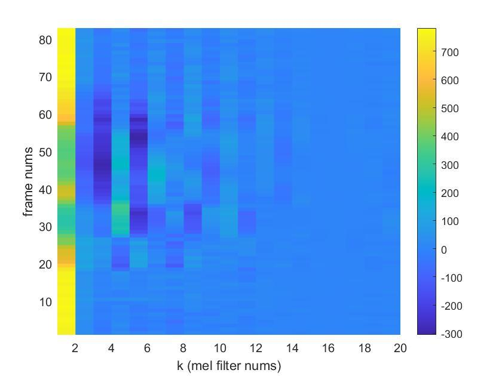

EEC 201

Winter 2020

Final Project

Speaker Recognition

James Nelson and Laura Shimabukuro


# Objective

The goal of this project is to extract features from human voices to build a system to classify a set of speakers.  Mel-Frequency Cepstrum Coefficients (MFCC) were used as features and Vector Quantization (VQ) was used as the training/classification system.

# Part 1: Speech Processing and Feature Extraction

Amplitude Normalization and Framing

In order for the system to perform speech recognition, the key features of each speaker must first be extracted from the input audio signals. The inputs into the system are .wav files sampled at 12500 Hz. An example time domain signal plot for speaker 1 from the training set is shown below in Figure 1.

After sampling, the signal undergoes amplitude normalization from -1 to 1 (center at 0 and standard deviation of 1) to account for sound volume variations. The normalized signal is then split into approximately 30 ms frames (frame length N = 256) with a slight overlap (overlap M = 100) between adjacent frames. The frame overlaps prevent data loss during processing.


**Figure 1: Speaker 1 Time Domain Plot**

```
   for k = 1:numFrames

        frames(k,:) = s(startindex:endindex);

        frames(k,:) = frames(k,:);

        startindex = startindex+N-M;

        endindex = startindex+N-1;
```

Windowing

Once the signal is split into frames, a hamming window, shown below in Figure 2, is applied to each frame to taper the end samples to equal near-zero amplitudes. If the end samples are not tapered to the same amplitude, they will show up as unwanted high frequency components when processed frame by frame through the STFT, because the periodicity of the DFT causes it to treat the disconnected beginning and end points as a discontinuity.


**Figure 2: Hamming Window**

```
y(k,:) = frames(****k****,:).*w';
```

Periodogram Generation

To estimate the spectral density of each signal, a periodogram estimate of the power spectral density is computed for each signal. First, the Short Time Fourier Transform is applied to each frame by taking an N length FFT of each frame and multiplying the output by a linear phase term to remove time normalization. The frame by frame output of the STFT is squared and averaged over the length of each frame.  Since it is realistically impossible to average the squared spectrum over an infinite interval, squaring over the frame length provides a suitable estimate for the PSD. After generating the frame by frame periodogram estimate, the full signal periodogram is computed by summing all of the individual frame periodograms together. The overlaps are taken into account by zero padding both sides of each frame vector to the correct length and position with respect to the original signal before the full summation. The output periodogram for speaker 1 is shown below in Figure 3.


**Figure 3: Speaker 1 Periodogram**

```
frames_fft(k,:) = fft(y(k,:));

% compute periodogram

P(k,:) = ((abs(exp(-1i.*M.*n.*(k-1)).*frames_fft(k,:))).^2)/N;

zp = zeros(1,(k-1).*M);

Pgram(k,:) = [zp P(k,:) zeros(1,abs(length(s)-length(zp)-length(P(k,:))))];
```

Filter Bank Generation

This system is designed to model human hearing, and since humans are better at sensing pitch differences at lower frequencies, mel frequency scaling is used to emphasize lower frequency components during feature extraction. First, a filter bank is generated with unity gain triangular filters spaced out on the mel scale. The filter bank start frequency was chosen at 300 Hz and the end frequency was chosen at half the sampling frequency of the input signal. After the start and end frequencies are converted to the mel scale and linearly spaced mel frequency points are computed, the points are reconverted to Hz and rounded to the nearest FFT bin. The formula used to generate the filter bank is shown below in Figure 4. The output filter bank is shown in Figure 5.


**Figure 4: Filter Bank Formula                      Figure 5: Filter Bank Plots**

```
start_freq = 300;

end_freq = fs/2;

m_start = 2595.*log10(1+start_freq/700);

m_end = 2595.*log10(1+end_freq./700);

m = linspace(m_start,m_end,nfilt+2);

f_Hz = 700*(10.^(m./2595)-1);

f_bin = floor((2*N+1).*f_Hz/fs);
```

```
% generate filter bank**

fbank = zeros(20,256);

for mel_k = 1:nfilt

        f_m_left = f_bin(mel_k);

        f_m_center = f_bin(mel_k+1);

        f_m_right = f_bin(mel_k+2);

        for k = f_m_left:f_m_center

            fbank(mel_k,k) = (k-f_bin(mel_k))/(f_bin(mel_k+1)-f_bin(mel_k));

            if fbank(mel_k,k)<=0

                fbank(mel_k,k)=0;

            end

        end

        for k = f_m_center:f_m_right

            fbank(mel_k,k) = (f_bin(mel_k+2)-k)/(f_bin(mel_k+2)-f_bin(mel_k+1));

            if fbank(mel_k,k)<=0

                fbank(mel_k,k)=0;

            end

        end

end
```

MFCC Feature Vector Extraction

To extract the MFCC feature array, the filter bank is multiplied to each frame. The outputs of the multiplication are vectors of MFCC coefficients, one per frame, with the vector size dependent on the number of filters used in the filter bank. The coefficients are converted to decibels before undergoing compression and decorrelation through the Discrete Fourier Transform. Decorrelation is a necessary step due to the overlapping of the filter banks and the subsequent overlapping of their corresponding energies.

The resulting spectrogram plot of the MFCC array for speaker 1 is shown below in Figure 6.


**Figure 6: Speaker 1 Spectrogram**

```
mfcc_array = zeros(numFrames,nfilt);

    for k = 1:numFrames

        mfcc_array(k,:) = dct(10*log10(fbank*P(k,:)'));

    end
```

Speech Processing Optimization

To improve speech recognition, an additional variance normalization step was taken through sinusoidal liftering. First, a weighting vector was generated to deemphasize higher MFCCs using the formula shown below (D = 15). The weighting vector was then multiplied to the MFCC array frame by frame. The improvement in feature extraction from performing variance normalization can be seen in the sharpened spectrogram for speaker 1 in Figure 8 compared to the unliftered MFCC array spectrogram in Figure 7. The sharpening effect is especially clear for higher MFCCs.


**Figure 7: Speaker 1 w/o Sinusoidal Liftering               Figure 8: Speaker 1 w/ Sinusoidal Liftering**

```
w=1+(15/2)*sin((1:nfilt)*pi/15);

mfcc_array = w.*mfcc_array;
```


The amplitude normalization step taken in the beginning also showed a noticeable improvement in the sharpness of the outputted spectrogram, as shown below for speaker 1.



**Figure 9: Speaker 1 w/o Amplitude Normalization         Figure 10: Speaker 1 w/ Amplitude Normalization**

# Part 2: Classification Through Vector Quantization

Classification Method

Classification of an input signal to the training set is done through a technique known as vector quantization.  After feature extraction, a signal will have a Mel Cepstrum Coefficient matrix (S) with dimensions the number of mel filters (mN) by number of frames (f).  Mathematically, each signal generates an S fxmN matrix.  During the training phase, the matrix S is shrunk to a codebook matrix C of size c x mN where c is the number of codebooks, or centroids, chosen and mN is still the number mel filters.  A well-known LBG algorithm [2] was used to create the training codebooks for classification.  This algorithm is shown in the following flow diagram (Fig 11). The goal of the algorithm is to split the set of training vectors and compare a test vector with the generated set of centroids (codebook) for each training vector. Whichever codebook is identified as having the smallest Euclidean distance between centroids and the test input is identified as belonging to the closest fitting training vector. For our MATLAB implementation, we used a library that inputs the MFCC coefficients and generates the desired codebook vector size [1].


**Figure 11. LBG Algorithm Flow Diagram**

Signal Length Normalization

Since the sum error of a long signal will be more than a short signal, some type of normalization must be done on the length of the signal to account for this.  We looked at two methods of normalizing for length.  Method 1 simply divides the


**Figure 12. Normalization of Length Method 1**

# 

**Figure 13. Normalization of Length Method 2 **

# Part 3: Classification Results

For classification results, we compare the human classification results (Tab. 1), to the baseline speaker classification system (Fig. 14), to our optimized system (Fig. 15).  For the purposes of this project, we assume human classification of speakers as the optimal solution. Shown below are the human classification results with two different individuals performing speech recognition.

<table>
  <tr>
    <td>SNR</td>
    <td>Result</td>
  </tr>
  <tr>
    <td>40dB</td>
    <td>Correct</td>
  </tr>
  <tr>
    <td>35dB</td>
    <td>Correct</td>
  </tr>
  <tr>
    <td>30dB</td>
    <td>Correct</td>
  </tr>
  <tr>
    <td>25dB</td>
    <td>Correct</td>
  </tr>
  <tr>
    <td>20dB</td>
    <td>Correct</td>
  </tr>
  <tr>
    <td>15dB</td>
    <td>Correct</td>
  </tr>
  <tr>
    <td>10dB</td>
    <td>Incorrect</td>
  </tr>
  <tr>
    <td>5dB</td>
    <td>Incorrect</td>
  </tr>
</table>


**Table 1. Human Classification Results**


**Figure 14. Unoptimized System Block Diagram**


**Figure 15. Optimized System Block Diagram**

To show the classification of an arbitrary input, we generate the following plot (Fig 16).


**Figure 16. Example Classification Output**

The x-axis represents the speaker’s numbers.  The y-axis shows the sum of all distances from the closest centroid i.e. how close the input signal is to the training set.  A lower distance therefore means higher similarity.  For example, in figure 16, the input of Speaker 1 is shown to have the smallest distance to the training set codebook of Speaker 1.

To test the boundary of our classification system, we add various levels of white, Gaussian noise to the input signal until an incorrect classification is made.  The results of the unoptimized system are shown in figure 17.  A correct classification is made with an SNR of 25dB and the system fails with SNR of 20dB.  Results of the optimized system are shown in figure 18 and in the cluster plots below. The addition of sinusoidal liftering in the feature extraction process increases the clustering spread, thus making it easier to set divisions between centroids and identify the best fit. By adding sinusoidal liftering after the DCT is calculated, the system is accurate to between 15-20dB, closer to the optimal solution of human recognition.


**Figure 17. Unoptimized System Results with Various Levels of Noise**


**Figure 18. Optimized System Results with Various Levels of Noise**

Additional tests were performed with speech files found online. Five different audio inputs, each with a different speaker, were tested at various levels of added noise. The results are shown below. The system showed 100% accuracy with SNRs above 15dB, 40% accuracy with an SNR of 10dB, and 0% accuracy with an SNR of 5dB. This system showed better accuracy than human classification at 10dB SNR, with the human accuracy at 0%.

<table>
  <tr>
    <td>SNR</td>
    <td>Speaker Results</td>
    <td></td>
    <td></td>
    <td></td>
    <td></td>
    <td>Accuracy Percentage</td>
  </tr>
  <tr>
    <td></td>
    <td>Afrikaans1</td>
    <td>Afrikaans2</td>
    <td>Afrikaans3</td>
    <td>Agni1</td>
    <td>Albanian1</td>
    <td></td>
  </tr>
  <tr>
    <td>40dB</td>
    <td>Correct</td>
    <td>Correct</td>
    <td>Correct</td>
    <td>Correct</td>
    <td>Correct</td>
    <td>100%</td>
  </tr>
  <tr>
    <td>35dB</td>
    <td>Correct</td>
    <td>Correct</td>
    <td>Correct</td>
    <td>Correct</td>
    <td>Correct</td>
    <td>100%</td>
  </tr>
  <tr>
    <td>30dB</td>
    <td>Correct</td>
    <td>Correct</td>
    <td>Correct</td>
    <td>Correct</td>
    <td>Correct</td>
    <td>100%</td>
  </tr>
  <tr>
    <td>25dB</td>
    <td>Correct</td>
    <td>Correct</td>
    <td>Correct</td>
    <td>Correct</td>
    <td>Correct</td>
    <td>100%</td>
  </tr>
  <tr>
    <td>20dB</td>
    <td>Correct </td>
    <td>Correct</td>
    <td>Correct </td>
    <td>Correct</td>
    <td>Correct</td>
    <td>100%</td>
  </tr>
  <tr>
    <td>15dB</td>
    <td>Correct</td>
    <td>Correct</td>
    <td>Correct</td>
    <td>Correct</td>
    <td>Correct</td>
    <td>100%</td>
  </tr>
  <tr>
    <td>10dB</td>
    <td>Incorrect</td>
    <td>Incorrect</td>
    <td>Correct</td>
    <td>Incorrect</td>
    <td>Correct</td>
    <td>40%</td>
  </tr>
  <tr>
    <td>5dB</td>
    <td>Incorrect</td>
    <td>Incorrect</td>
    <td>Incorrect</td>
    <td>Incorrect</td>
    <td>Incorrect</td>
    <td>0%</td>
  </tr>
</table>


**Table 2. Classification Results for Outside Sourced Speakers**


# Part 4: MATLAB Graphical User Interface (GUI)

To interface with our training and classification system, a GUI was created using MATLAB AppDesigner.  The GUI allows the user to record a training input and a test input to add to the default 11 speakers.  As the final test on our system, we input 2 different male voices as a training and test input, to verify that different recording conditions from the provided training set did not lead to false classifications.  As shown in figure 19, the test input does not classify to the training input, as expected.  This verifies that the features extracted correspond to the speaker and the recording conditions have a negligible effect on the classification.


**Figure 19. MATLAB Graphical User Interface (GUI)**

# Conclusion

The performance of the speech recognition system was not only very accurate at high noise levels, but also showed a higher rate of accuracy than human recognition. Through the use of amplitude and variance normalization, the speech extraction process was optimized and led to increased recognition accuracy. The use of the LBG algorithm to identify the closest matching speaker was successful in identifying the test speakers.

# References

[1]  Vector Quantization - K-means.  MATLAB file exchange. [https://www.mathworks.com/matlabcentral/fileexchange/10943-vector-quantization-k-means](https://www.mathworks.com/matlabcentral/fileexchange/10943-vector-quantization-k-means)

[2] Y. Linde, A. Buzo & R. Gray, "An algorithm for vector quantizer design", IEEE Transactions on Communications, Vol. 28, pp.84-95, 1980

[3] S.B. Davis and P. Mermelstein, "Comparison of parametric representations for monosyllabic word recognition in continuously spoken sentences", IEEE Transactions on Acoustics, Speech, Signal Processing, Vol. ASSP-28, No. 4, August 1980.

[4] F.K. Song, A.E. Rosenberg and B.H. Juang, "A vector quantisation approach to speaker recognition", AT&T Technical Journal, Vol. 66-2, pp. 14-26, March 1987.

[5] Additional Speech Files Source

[https://lionbridge.ai/datasets/best-speech-recognition-datasets-for-machine-learning/](https://lionbridge.ai/datasets/best-speech-recognition-datasets-for-machine-learning/)
